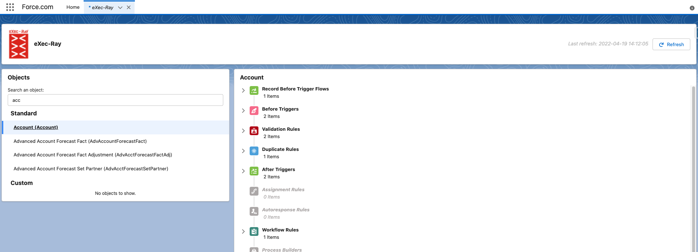

eXec-Ray
========================================

We make visible the invisible. Visualize your org's automations according to the oficial Order of Execution.

Background
----------

Order of execution in Salesforce is the set of events performed when you save a record of any standard or custom object with a insert, update or upsert operation. To have this order clear will help you to design the correct solution, to debug any issue and analyze legacy organizations.

The only way to to visualize what happens when you store a record is reviewing the [official order of execution page](https://developer.salesforce.com/docs/atlas.en-us.apexcode.meta/apexcode/apex_triggers_order_of_execution.htm) and go one by one to each involved element in your Salesforce org. 

With eXec-Ray you will be able to see the order of execution for a given object. The app list every customizable objects in your Salesforce org (standard and custom) and when select one of them, you can see every events that are going to be executed when you save a record of that object and taking into account the mentioned Salesforce order of execution. 

Packaged Release History
------------------------

Release 1.0.0 (current release)
-----------

* Install Package
    * Browser Links ([Production](https://login.salesforce.com/packaging/installPackage.apexp?p0=04t8a000000u6P8AAI)) ([Sandbox](https://test.salesforce.com/packaging/installPackage.apexp?p0=04t8a000000u6P8AAI))
    * Salesforce CLI (`sfdx force:package:install --package 04t8a000000u6P8AAI --wait 10`)
* [Closed Issues](https://github.com/S4GConsulting/eXec-Ray/issues?q=is%3Aissue+is%3Aclosed)
* [Open Issues](https://github.com/S4GConsulting/eXec-Ray/issues?q=is%3Aopen+is%3Aissue)

Getting Started
---------------

1. Create [Connected App](https://help.salesforce.com/s/articleView?id=sf.connected_app_create.htm&type=5)
    
    **Basic Information**
    
    * Connected App Name: eXec-Ray    
    * API Name: eXecRay    
    * Contact Email: youremail@yourcompany.com    
    * Logo Image URL: https://github.com/S4GConsulting/eXec-Ray/blob/main/force-app/main/default/staticresources/eXecRayLogo.png

    
    **API (Enable OAuth Settings)**
    
    * Enable OAuth Settings: true
    * Callback URL: https://*yourdomain*.my.salesforce.com/services/authcallback/eXec_Ray
    * Selected OAuth Scopes: 
        * Full access(full) 
        * Perform requests at any time (refresh_token, offline_access)
    
    *Leave other fields as presented*
    
    *Try to have the Consumer Key and Consumer Secret information in hand because both values and necessay in the next step*

2. Update eXec-Ray [Auth Provider](https://help.salesforce.com/s/articleView?id=sf.sso_authentication_providers.htm&type=5)
    
    * Consumer Key: use the consumer key of the previouly created connected app     
    * Consumer Secret: use the consumer secret of the previouly created connected app 

3. Edit the eXec-Ray [Named Credential](https://help.salesforce.com/s/articleView?id=sf.named_credentials_about.htm&type=5)
    * URL: https://*yourdomain*.my.salesforce.com/
    
    *Leave other fields as presented*
    
    *This will lunch a Salesforce login window to authorize our app to be used in your org in your name. If you get the error "error=invalid_client_id&error_description=client%20identifier%20invalid" is because the connected app is being published. Please wait some minutes and try to save again with the same information*

4. In order to use the Platform Cache and ease the loading time of objects already loaded, you need to create a new record for the Custom Setting, eXec-Ray Settings. You will need to have the field Use Platform Cache set to true.

5. Assign de eXec-Ray permission set to the people that will use the app. Take in account that the permission set only give access to the app, needed permissions to see elements are not included.

FAQ
===

If one of your questions isn't answered below, please search and comment on [existing issues](https://github.com/S4GConsulting/eXec-Ray/issues?q=is%3Aopen+is%3Aissue) before opening a new one. Thanks! 

Please have a look at the [CONTRIBUTING](https://github.com/S4GConsulting/eXec-Ray/blob/main/CONTRIBUTING.md) guidelines.

Credits
=======

Thanks [S4G](https://s4g.es/) to allow us to make this project and make it available for the community.

Thank you all contributors for the effort, enthusiasm and desire in this project:
* [Raúl Iglesias](https://github.com/RaulIglesiasS4G) 
* [Héctor Martínez](https://github.com/hmolto)
* [Juanjo Prieto](https://github.com/WyrnCael)
* [Andrés Ortiz](https://github.com/AndresOrtizL)
* [José Caballero](https://github.com/josecaballeromunoz)
* [Jonathan Wiesel](https://github.com/jonathanwiesel)
* [Roberto Arconada](https://github.com/RobertoArconadaS4G) 